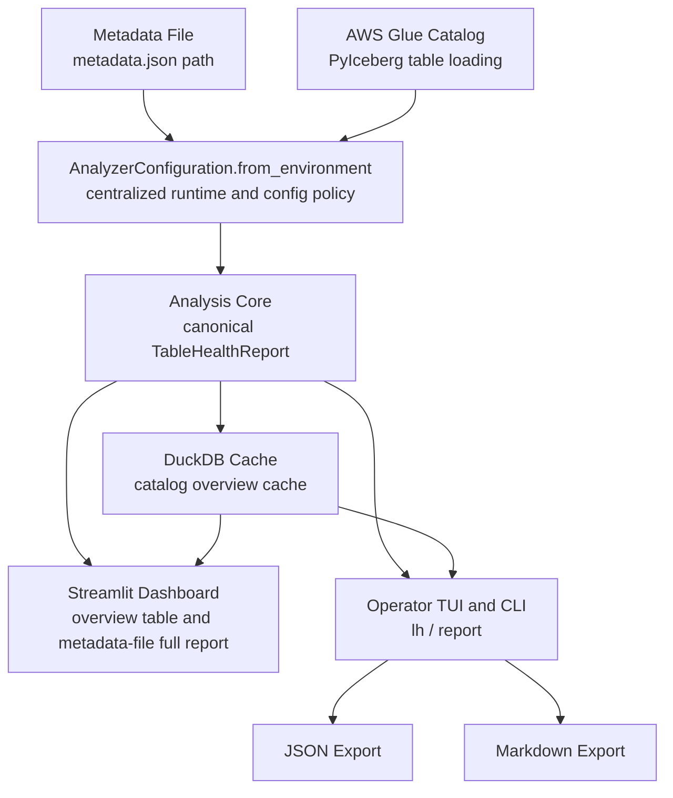

# Lakehouse Health Analyzer

Analyze Apache Iceberg table metadata through one canonical `TableHealthReport` model shared by Streamlit, terminal workflows, and exports.

Architecture decisions live in [docs/adr](docs/adr), and the current operator
TUI modernization notes live in
[docs/operator-tui-modernization.md](docs/operator-tui-modernization.md).

## Demo


## Scope in this version

- Table format: Apache Iceberg
- Table sources:
  - Metadata file source (`metadata.json` path)
  - AWS Glue catalog table source (`pyiceberg` Glue catalog loading)
- Interfaces:
  - Streamlit dashboard (`streamlit_app.py`)
  - Operator terminal workflow (`lakehouse-health-operator`)
- Outputs:
  - JSON structured report exports
  - Markdown summary report exports
- Included report sections:
  - Health metrics, display statistics, partition metrics
  - Snapshot and retained table evolution metrics
  - Maintenance recommendations with evidence and thresholds

Out of scope for this version:

- Orphan-file identification details and orphan-file cleanup actions
- Non-Iceberg table formats (for example Hudi or Delta Lake)
- Non-Glue catalog integrations

## Architecture (current implementation)



## `uv` workflow (supported path)

```bash
uv sync --extra dev
uv run pytest
```

Run all project commands through `uv run`.

## Runtime configuration

Configuration is loaded by `AnalyzerConfiguration.from_environment()`.

The project uses **catalog namespace** as the canonical term for the
catalog-scoped grouping that contains tables. In AWS Glue, this is the Glue
database, so Glue-facing UI may label the same value as "Database" for
readability.

The setup command saves reusable defaults to
`${XDG_CONFIG_HOME:-~/.config}/lakehouse-health-analyzer/config.toml`.
Configuration precedence is:

1. Built-in defaults
2. Setup config file
3. Environment variables
4. CLI flags or UI overrides

Detailed setup behavior is captured in
[docs/operator-tui-modernization.md](docs/operator-tui-modernization.md).

Required for metadata-file analysis:

- `LHA_METADATA_LOCATION`

Required for Glue catalog-table analysis:

- `LHA_TABLE_SOURCE_KIND=glue_catalog_table`
- `LHA_GLUE_CATALOG_NAME`
- `LHA_GLUE_NAMESPACE` (the Glue database; dot-separated for operator/table analysis; Streamlit catalog overview currently supports a single namespace component)
- `LHA_GLUE_TABLE_NAME`

Optional policy and runtime settings:

- `LHA_AWS_PROFILE`
- `LHA_AWS_REGION`
- `LHA_SNAPSHOT_RETENTION_DAYS` (default `30`)
- `LHA_RECOMMENDATION_THRESHOLDS` (JSON object)
- `LHA_CACHE_TTL_SECONDS` (default `900`)
- `LHA_TIMEOUT_SECONDS` (default `30`)
- `LHA_MAX_CONCURRENCY` (default `4`)
- `LHA_EXPORT_FORMATS` (comma-separated: `json`, `markdown`)
- `LHA_EXPORT_DIRECTORY`

## Run Streamlit

```bash
uv run streamlit run streamlit_app.py
```

In the UI you can:

- Analyze a single metadata file
- Load catalog overview rows for Glue tables
- View cache status for overview rows (`fresh` or `cached`)
- Review recommendations, warnings, partitions, and evolution history for metadata-file report views

The current Streamlit catalog view is an overview table. Full catalog-table drilldown is tracked separately from this version's completed scope.

## Run Operator Workflow

Run setup once to save reusable Glue catalog defaults:

```bash
uv run lakehouse-health-operator setup
```

The default operator command opens the interactive Textual TUI. `lh` is the
short alias for the same entry point:

```bash
uv run lakehouse-health-operator
uv run lh
```

Example environment for Glue catalog workflow:

```bash
export LHA_TABLE_SOURCE_KIND=glue_catalog_table
export LHA_GLUE_CATALOG_NAME=analytics
export LHA_GLUE_NAMESPACE=sales
export LHA_GLUE_TABLE_NAME=orders
```

In the TUI you can browse catalog namespaces, load tables, analyze a selected
table, refresh visible catalog/table data, and export the selected report.

Generate non-interactive reports with the explicit `report` subcommand:

```bash
uv run lakehouse-health-operator report sales.orders --format json
uv run lakehouse-health-operator report sales.orders --format markdown
uv run lh report sales.orders --format json
```

Interactive TUI behavior, layout, styling, and key bindings are captured in
[docs/operator-tui-modernization.md](docs/operator-tui-modernization.md).

## Cache Behavior

- Backend: DuckDB
- Default path: `${XDG_CACHE_HOME:-~/.cache}/lakehouse-health-analyzer/catalog-overview.duckdb`
- Default TTL: 900 seconds (15 minutes)
- Expired, missing, or unreadable cache entries are treated as misses
- Operator-facing values may be cached when they are visibly marked as cached
  and refreshable.

## Export Workflow

Enable default export destinations through output policy environment variables:

```bash
export LHA_EXPORT_FORMATS=json,markdown
export LHA_EXPORT_DIRECTORY=/tmp/lha-exports
uv run lakehouse-health-operator report sales.orders --format json,markdown
```

Exports are written as:

- `<table-name-with-dots-replaced-by-dashes>.json`
- `<table-name-with-dots-replaced-by-dashes>.md`

For example, `sales.orders` exports to `sales-orders.json` and `sales-orders.md`.

JSON preserves the canonical report structure. Markdown is a readable summary with source, cache/analyzed metadata, health metrics, warnings, and recommendation summaries.

`LHA_EXPORT_DIRECTORY` must already exist. You can also pass an explicit output
path or output directory:

```bash
uv run lakehouse-health-operator report sales.orders --format json
uv run lakehouse-health-operator report sales.orders --format markdown
uv run lakehouse-health-operator report sales.curated.orders --format json
uv run lakehouse-health-operator report sales.orders --format json --output /tmp/sales-orders.json
uv run lakehouse-health-operator report sales.orders --format json,markdown --output-dir /tmp/lha-exports
```

The final identifier segment is the table name; earlier segments make up the
catalog namespace. The report command prints JSON or Markdown to stdout
by default, and write a file only when an explicit output path or configured
output policy requests it.

## Recommendation workflow

Current recommendation types in report outputs:

- `compaction`
- `snapshot_expiration`
- `metadata_cleanup`
- `delete_file_cleanup`

Severity values are `info`, `warning`, or `critical`, with thresholds optionally overridden via `LHA_RECOMMENDATION_THRESHOLDS`.

## Testing

```bash
uv run pytest
```

## License

MIT. See [LICENSE](LICENSE).
