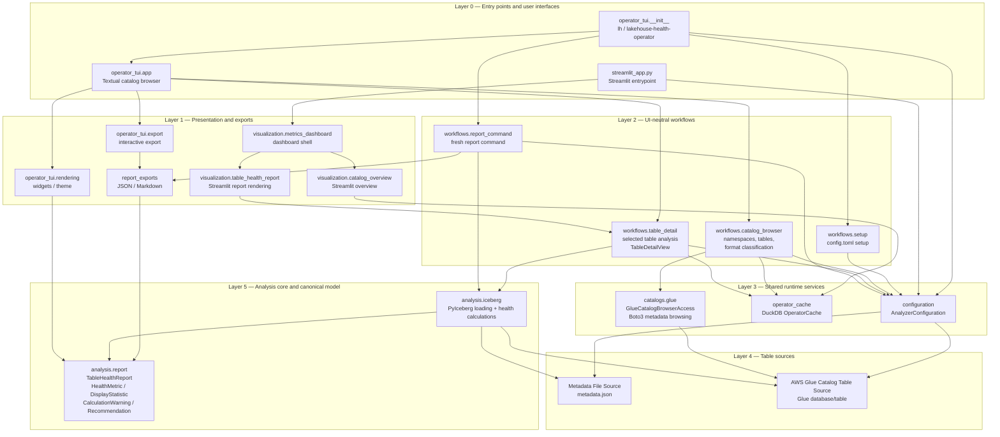

# Lakehouse Health Analyzer Architecture

This project analyzes lakehouse table metadata through a canonical
`TableHealthReport` model shared by the terminal workflow, Streamlit, exports,
and tests.

## Current component map

## Main layers

- **Configuration layer**: `configuration.AnalyzerConfiguration` normalizes table
  source, analysis policy, runtime policy, and output policy.
- **Calculation layer**: `analysis.iceberg` loads Iceberg tables with PyIceberg
  and derives canonical health metrics.
- **Common representation layer**: `analysis.report.TableHealthReport` is the
  shared report shape rendered by TUI, Streamlit, CLI, and exports.
- **Workflow layer**: `workflows/*` owns UI-neutral use cases such as catalog
  browsing, selected-table detail analysis, setup, and scriptable report
  generation.
- **Cache layer**: `operator_cache.OperatorCache` stores temporary DuckDB-backed
  namespace listings, table listings, table classifications, and table detail
  reports.
- **Interface layers**:
  - `operator_tui/*` renders and operates the Textual terminal interface.
  - `streamlit_app.py` and `visualization/*` render Streamlit views.
  - `report_exports` renders JSON and Markdown report outputs.

## Important direction

Rendering layers may format, group, filter, colorize, or lay out report values,
but they should not own catalog behavior or canonical health calculations.
Those belong in workflow, catalog-access, and analysis modules.
